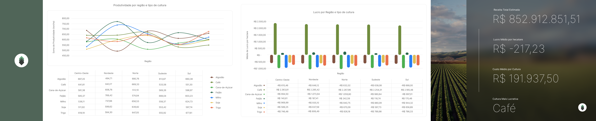

# Henriky Sena

### Analista de Dados | Excel • SQL • Python • Power BI  
Transformo dados brutos em análises claras, documentadas e reprodutíveis.

Sou Analista de Dados, formado em **Análise e Desenvolvimento de Sistemas (FATEC, 2025)**.  
Atuei como **UX/UI Designer** e **Desenvolvedor Front-End**, o que fortaleceu minha visão de **usabilidade, narrativa visual e clareza analítica**.

Atualmente, foco em **EDA, estruturação de dados e documentação metodológica**.

## ⚙️ Ferramentas
Apaixonado por transformar caos em clareza, para isso utilizo:

 

## ⭐ Projeto em Destaque

### 🔌 Projeto 03 — Distribuição e Consumo Elétrico no Brasil (BIG DATA)

Análise exploratória e estrutural da base **BDGD/ANEEL**, cobrindo unidades consumidoras de **alta, média e baixa tensão**.

**Foco metodológico:**
- preservação integral do dado bruto  
- validação estrutural dos datasets  
- documentação analítica contínua  
- construção de modelo mental antes da visualização  

🛠️ **Power BI • PostgreSQL • Python**  
🔗 **[Acessar projeto](https://github.com/henrikySena/EDA-Analises_Exploratorias/tree/main/Projeto_03_Consumo_Eletrico)**  
📌 *Status: Em desenvolvimento*

---
 

## Projetos Aplicados

### 🧱 Projeto 01 — Materiais de Construção

Análise exploratória de vendas de uma loja local, com foco em:
- limpeza e organização dos dados  
- definição de KPIs  
- tabelas dinâmicas  
- dashboards analíticos  

🛠️ **Excel • Figma**  
🔗 [Acessar projeto](https://github.com/henrikySena/EDA-Analises_Exploratorias/tree/main/Projeto_01_Materiais_de_Construcao)

 

### 🌾 Projeto 02 — Produção Agrícola

EDA de um dataset agrícola fictício, explorando:
- produtividade das safras  
- qualidade e custos  
- lucratividade  
- construção de métricas e KPIs  

🛠️ **Excel • Figma**  
🔗 [Acessar projeto](https://github.com/henrikySena/EDA-Analises_Exploratorias/tree/main/Projeto_02_Producao_Agricola)

---
 

## 📫 Contato

- **LinkedIn:** https://www.linkedin.com/in/henriky-sena-643010234  
- **Email:** senahsr55@gmail.com  

---

<i>Clareza antes da visualização. Consistência antes da escala.</i>

